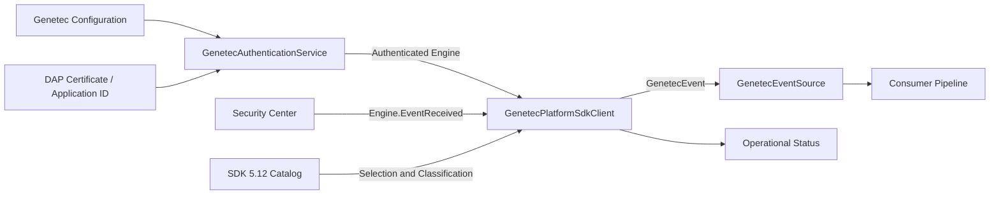
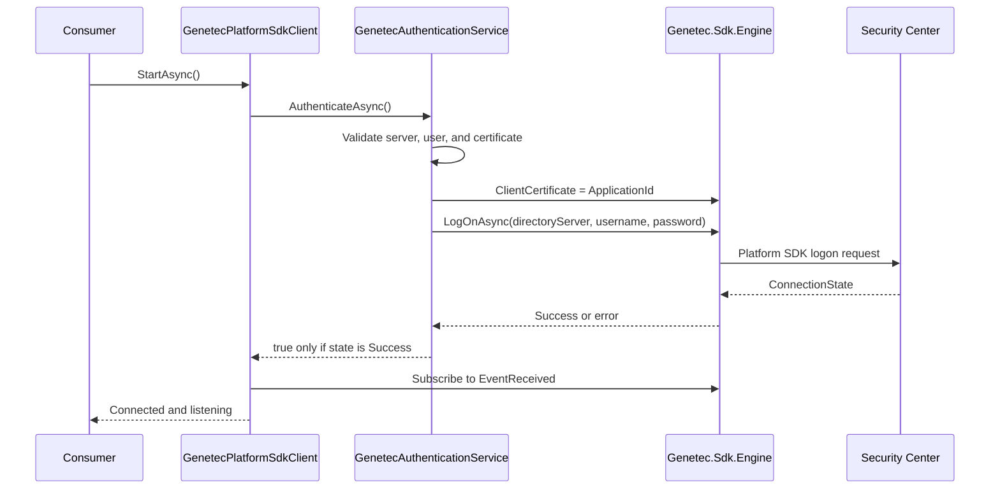

# Technical Documentation — Genetec Integration Code

> **Language / Idioma:** English | [Español](DOCUMENTACION_TECNICA.md)  
> **README:** [README_EN.md](README_EN.md) ([Español](README.md))

## 1. Objective

This module receives real-time events from Genetec Security Center via Platform SDK 5.12 and transforms them into a stable internal contract (`GenetecEvent`). The scope of this package concludes at that contract: downstream forwarding to other systems is out of scope.

## 2. Architecture

## 3. Component Responsibilities

| Component | Responsibility |
|---|---|
| `GenetecSdkAssemblyResolver` | Locates and loads managed and native SDK dependencies on Windows. |
| `GenetecApplicationCertificateLoader` | Parses the application `.cert`/XML file, extracts a single `ApplicationId`, and calculates an abbreviated SHA-256 fingerprint for diagnostics. It never exposes the full raw certificate content in logs. |
| `GenetecAuthenticationService` | Maintains a single shared instance of `Genetec.Sdk.Engine`, assigns `Engine.ClientCertificate`, executes `LogOnAsync`, validates the returned state, handles session events, and orchestrates retries. |
| `GenetecPlatformSdkClient` | Manages the connection lifecycle, registers `Engine.EventReceived`, filters according to the configured selection, decouples the SDK callback via a bounded queue, and converts SDK events into the internal domain model. |
| `GenetecEventSource` | Facade utilized by the rest of SentinelBridge to initialize, start, stop, and consume events without coupling directly to SDK types. |
| `GenetecEventCatalog` | Versioned catalog of 599 event identifiers extracted from SDK 5.12.2181.44, including category, severity, and Spanish presentation text. |
| `ServiceOperationalStatusStore` | Tracks and publishes operational progression: SDK loaded, authentication, subscription, and event metrics. Provides adapter observability and is independent of the Genetec protocol. |

## 4. Authentication Sequence

Authentication is not considered complete merely through raw TCP connectivity. The resulting state must strictly evaluate to `Success`, the session event must confirm an active connection, and subscription to the configured event selection must be confirmed.

The application certificate is not a server TLS certificate. It represents the application identity granted by Genetec via the DAP program and must correspond to the licensed part number enabled on the target Security Center system.

## 5. Event Reception and Filtering

1. The client expands the configured selection into exact catalog identifiers.
2. If the selection is empty, the client does not mark the service as subscribed.
3. It registers the `Engine.EventReceived` callback exactly once.
4. Within the callback, it extracts `EventType`, `SourceGuid`, `Timestamp`, `GroupId`, and `SpecificEvent`.
5. It normalizes the type name and locally discards unselected events.
6. It pushes an immutable wrapper into a concurrent queue bounded at 10,000 elements, preventing expensive operations inside the synchronous SDK callback.
7. An asynchronous background worker resolves the source entity in a read-only manner via `Engine.GetEntity(SourceGuid)` and instantiates `GenetecEvent`.

Filtering is executed locally downstream of `Engine.EventReceived`; it does not configure a remote server-side filter in Security Center.

## 6. Normalized Data

The `GenetecEvent` model preserves at minimum:

- Stable internal identifier;
- Numerical ID and canonical SDK `EventType` name;
- `SourceGuid`;
- Event timestamp;
- `GroupId` when present;
- Category and severity derived from the catalog;
- Localized description;
- Basic source entity metadata;
- Safe scalar or textual properties extracted from the event's specific payload.

Events are not indiscriminately coerced into access control events. The category is determined by the exact event definition and may represent alarm, access control, video, health, or custom event categories.

## 7. SDK Usage

| SDK API / Type | Usage |
|---|---|
| `Genetec.Sdk.Engine` | Primary session management and read-only entity access. |
| `Engine.ClientCertificate` | Application ID loaded from the DAP certificate. |
| `Engine.LogOnAsync(...)` | Directory Server authentication. |
| `Engine.LogOff()` | Controlled session teardown. |
| `Engine.EventReceived` | Global event listener hook. |
| `EventReceivedEventArgs.EventType` | Event identification and exact filtering. |
| `EventReceivedEventArgs.SourceGuid` | Originating entity identity. |
| `EventReceivedEventArgs.Timestamp` | Event timestamp reported by the SDK. |
| `EventReceivedEventArgs.SpecificEvent` | Additional event-specific data payload. |
| `Engine.GetEntity(Guid)` | Read-only lookup of originating entity name and type. |

This integration does not execute write operations in Security Center, alarm state alterations, PTZ or camera controls, video streaming, credential/cardholder modifications, Web SDK, Media SDK, or plugins for Security Desk/Config Tool.

## 8. Configuration

Required configuration parameters:

- `DirectoryServer`: DNS hostname or authorized IP address of the Directory Server.
- `Port`: Port registered in SentinelBridge configuration.
- `Username` & `Password`: Dedicated Security Center service account credentials.
- `ApplicationCertificatePath`: Filesystem path to the DAP application certificate file.
- `ConnectionTimeout`: Timeout duration for the authentication handshake.
- `EventTypes`: List of exact event IDs/names that should be forwarded to the consumer.

Note for technical review: The current `Engine.LogOnAsync` overload accepts `DirectoryServer`, username, and password; the `Port` value is retained in configuration and diagnostics, but is not passed explicitly to that call.

## 9. Lifecycle and Operational States

- `InitializeAsync`: Updates configuration parameters and binds internal lifecycle events.
- `StartAsync`: Verifies SDK availability, authenticates, spawns the processing worker, and registers event listeners.
- `Running`: Valid only once both authentication and event subscription are active.
- `StopAsync`: Unsubscribes from events, terminates background processing, and cleanly signs off the session.
- `Faulted`: Retains actionable root-cause error information when SDK loading or authentication fails.

`PrefetchEntitiesAsync` does not execute mass preloading; entities are resolved on-demand using the `SourceGuid` of each incoming event.

## 10. Included Test Suite

- Parsing and validation of DAP certificate / Application ID;
- Connection states: accepted, rejected, and retriable conditions;
- Client initialization and lifecycle management;
- Catalog integrity, selection migration, and localization;
- Graceful degradation when the SDK is absent.

The included test suite does not require a live server session. Full live acceptance validation requires an authorized Security Center environment, compatible Platform SDK 5.12, DAP certificate/Application ID, corresponding licensed part number, service account, and at least one configured event triggered under controlled conditions.

## 11. Review and Validation Inquiries for Genetec

- Confirm that the Application ID/certificate matches the part number allocated to the product;
- Confirm that the part number is enabled in the target Security Center license;
- Validate the `LogOnAsync` overload utilized for SDK 5.12 and Directory Server resolution;
- Confirm that `Engine.EventReceived` is the recommended mechanism for the selected event families;
- Confirm minimum necessary service account permissions required to receive events and query originating entities;
- Clarify any additional distribution prerequisites for Platform SDK runtime libraries or certificates.
