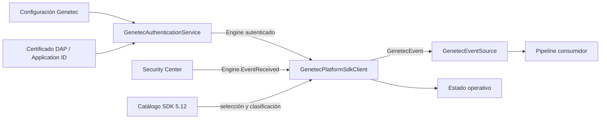
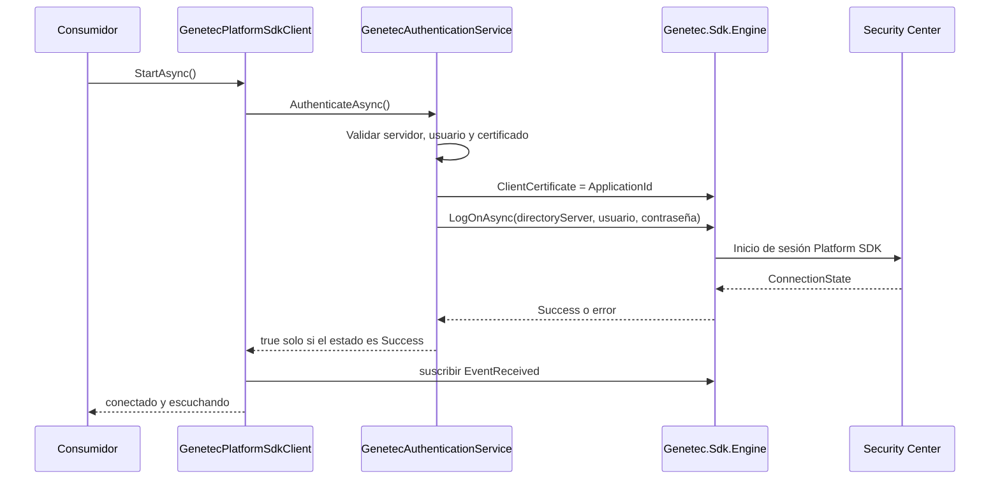

# Explicación técnica del código de integración con Genetec

> **Idioma / Language:** Español | [English](DOCUMENTACION_TECNICA_EN.md)  
> **README:** [README.md](../README.md) ([English](../README_EN.md))

## 1. Objetivo

El módulo recibe eventos en tiempo real desde Genetec Security Center mediante el Platform SDK 5.12 y los transforma a un contrato interno estable (`GenetecEvent`). Este paquete termina en ese contrato: el envío posterior a otros sistemas está fuera del alcance.

## 2. Arquitectura

## 3. Responsabilidades por componente

| Componente | Responsabilidad |
|---|---|
| `GenetecSdkAssemblyResolver` | Localiza y carga las dependencias administradas y nativas del SDK en Windows. |
| `GenetecApplicationCertificateLoader` | Lee el archivo `.cert`/XML de aplicación, extrae un único `ApplicationId` y calcula una huella SHA-256 abreviada para diagnóstico. No expone el contenido completo en logs. |
| `GenetecAuthenticationService` | Mantiene una única instancia compartida de `Genetec.Sdk.Engine`, asigna `Engine.ClientCertificate`, ejecuta `LogOnAsync`, valida el estado devuelto, maneja eventos de sesión y aplica reintentos. |
| `GenetecPlatformSdkClient` | Conecta el ciclo de vida, registra `Engine.EventReceived`, filtra la selección configurada, desacopla el callback mediante una cola limitada y convierte el evento SDK al modelo interno. |
| `GenetecEventSource` | Fachada usada por el resto de SentinelBridge para inicializar, iniciar, detener y recibir eventos sin depender directamente de los tipos del SDK. |
| `GenetecEventCatalog` | Catálogo versionado de 599 identificadores de evento extraídos del SDK 5.12.2181.44, con categoría, severidad y texto de presentación en español. |
| `ServiceOperationalStatusStore` | Publica el progreso operativo: SDK cargado, autenticación, suscripción y métricas. Es observabilidad del adaptador, no parte del protocolo Genetec. |

## 4. Secuencia de autenticación

La autenticación no se considera correcta por una simple conectividad TCP. El resultado debe ser exactamente `Success`, el evento de sesión debe reflejar conexión y posteriormente debe quedar activa la suscripción a eventos seleccionados.

El certificado de aplicación no es un certificado TLS del servidor. Es la identidad de la aplicación asignada por Genetec/DAP y debe corresponder al part number/licencia habilitado en el sistema objetivo.

## 5. Recepción y filtrado de eventos

1. El cliente expande la selección configurada a identificadores exactos del catálogo.
2. Si la selección está vacía, no declara el servicio como suscrito.
3. Registra el callback `Engine.EventReceived` una sola vez.
4. En el callback obtiene `EventType`, `SourceGuid`, `Timestamp`, `GroupId` y `SpecificEvent`.
5. Normaliza el nombre del tipo y descarta localmente los eventos no seleccionados.
6. Coloca una envoltura inmutable en una cola concurrente limitada a 10 000 elementos, evitando trabajo pesado dentro del callback del SDK.
7. Un procesador asíncrono resuelve, de forma de solo lectura, la entidad mediante `Engine.GetEntity(SourceGuid)` y crea `GenetecEvent`.

El filtro es local, posterior a `Engine.EventReceived`; no configura un filtro remoto en Security Center.

## 6. Datos normalizados

El modelo `GenetecEvent` conserva como mínimo:

- identificador interno estable;
- identificador numérico y nombre exacto del `EventType` del SDK;
- `SourceGuid`;
- fecha/hora del evento;
- `GroupId` cuando existe;
- categoría y severidad derivadas del catálogo;
- descripción localizada;
- información básica de la entidad de origen;
- propiedades escalares o textuales seguras del objeto específico del evento.

Los eventos no se convierten indiscriminadamente a control de acceso. La categoría se determina por el evento exacto y puede ser alarma, control de acceso, video, salud o personalizada.

## 7. Uso del SDK

| API/tipo del SDK | Uso |
|---|---|
| `Genetec.Sdk.Engine` | Sesión principal y acceso de solo lectura a entidades. |
| `Engine.ClientCertificate` | Application ID cargado desde el certificado DAP. |
| `Engine.LogOnAsync(...)` | Autenticación contra Directory Server. |
| `Engine.LogOff()` | Cierre controlado de la sesión. |
| `Engine.EventReceived` | Recepción global de eventos. |
| `EventReceivedEventArgs.EventType` | Identificación y filtrado exacto del evento. |
| `EventReceivedEventArgs.SourceGuid` | Identidad de la entidad origen. |
| `EventReceivedEventArgs.Timestamp` | Momento informado por el SDK. |
| `EventReceivedEventArgs.SpecificEvent` | Datos adicionales específicos del evento. |
| `Engine.GetEntity(Guid)` | Lectura de nombre/tipo de la entidad origen. |

No se incluyen operaciones de escritura en Security Center, cambios de alarmas, control de cámaras, video, modificación de credenciales/tarjetahabientes, Web SDK, Media SDK ni plugins de Security Desk/Config Tool.

## 8. Configuración

Los valores necesarios son:

- `DirectoryServer`: nombre DNS o dirección autorizada del Directory Server.
- `Port`: puerto registrado en la configuración de SentinelBridge.
- `Username` y `Password`: cuenta de servicio de Security Center.
- `ApplicationCertificatePath`: ruta al archivo de identidad de aplicación entregado mediante DAP.
- `ConnectionTimeout`: límite de la operación de autenticación.
- `EventTypes`: lista de eventos exactos que deben publicarse hacia el consumidor.

Nota para la revisión: la sobrecarga actual de `Engine.LogOnAsync` recibe `DirectoryServer`, usuario y contraseña; el valor `Port` se conserva en la configuración y diagnóstico, pero no se pasa explícitamente a esa llamada.

## 9. Ciclo de vida y estados

- `InitializeAsync`: actualiza la configuración y conecta los eventos internos.
- `StartAsync`: valida SDK, autentica, inicia el procesador y registra la escucha.
- `Running`: solo es válido cuando hay autenticación y suscripción activa.
- `StopAsync`: elimina la suscripción, detiene el procesador y cierra la sesión.
- `Faulted`: conserva la causa raíz útil cuando falla el SDK o la autenticación.

`PrefetchEntitiesAsync` no hace una precarga masiva: las entidades se resuelven bajo demanda usando el `SourceGuid` de cada evento.

## 10. Pruebas incluidas

- carga y validación del certificado/Application ID;
- estados de conexión aceptados, rechazados y reintentables;
- inicialización y ciclo de vida del cliente;
- catálogo, migración de selecciones y localización al español;
- comportamiento cuando el SDK no está disponible.

Las pruebas incluidas no prueban una sesión real. La aceptación en vivo requiere un entorno Security Center autorizado, SDK 5.12 compatible, certificado/Application ID DAP, licencia/part number asociado, cuenta de servicio y al menos un evento seleccionado y generado de forma controlada.

## 11. Puntos solicitados para validación por Genetec

- confirmar que el Application ID/certificado corresponde al part number asignado al producto;
- confirmar que ese part number está habilitado en la licencia del Security Center objetivo;
- validar la sobrecarga de `LogOnAsync` usada para SDK 5.12 y la resolución del Directory Server;
- confirmar que `Engine.EventReceived` es el mecanismo adecuado para las familias de eventos seleccionadas;
- confirmar permisos mínimos de la cuenta de servicio para recibir eventos y consultar las entidades origen;
- confirmar cualquier requisito adicional de distribución de runtimes o certificados del Platform SDK.
